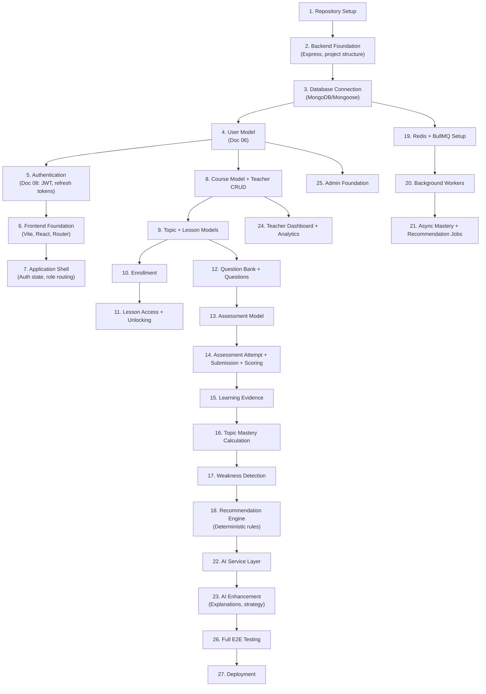

# Phase 0 — Architecture Verification Report

> **Scope:** Cross-document consistency audit of all 14 approved documents + `AGENTS.md`
> **Mode:** READ-ONLY — no files created, modified, or deleted
> **Date:** 2026-08-23

---

## 1. VERIFIED AREAS

The following cross-document relationships are **consistent and well-aligned**.

### 1.1 Core Learning Loop
Documents `01`, `02`, `03`, `04`, `09`, `13` all describe the same learning loop:
```
Learn → Practice → Assess → Analyze → Personalize → Remediate → Reassess → Improve
```
No contradictions found. The loop is referenced identically across product requirements, MVP scope, student learning model, user journeys, AI personalization engine, and current progress.

### 1.2 Modular Monolith Architecture
Documents `05`, `10`, `13`, `14`, and `AGENTS.md` consistently define the architecture as a modular monolith with explicit prohibition of premature microservices. Worker separation is correctly framed as process-level isolation, not service decomposition.

### 1.3 Technology Stack
All documents referencing technology (`05`, `07`, `10`, `11`, `13`, `14`, `AGENTS.md`) agree on:
- React + Vite + React Router + Tailwind CSS + Framer Motion + shadcn/ui
- Node.js + Express.js
- MongoDB + Mongoose
- Redis + BullMQ
- JWT (access + refresh tokens)

### 1.4 Authorization Model
Documents `07`, `08`, `12`, and `AGENTS.md` consistently define layered authorization:
```
Authentication → Role → Ownership → Relationship → Business Rule
```
All four documents explicitly state that role alone is insufficient and that ownership/relationship checks are mandatory. Consistent examples (Teacher A cannot access Teacher B's course) appear in `07`, `08`, `12`, and `AGENTS.md`.

### 1.5 Backend-Authoritative State
Documents `03`, `07`, `08`, `09`, `11`, `12`, and `AGENTS.md` are fully aligned that the backend is authoritative for:
- Assessment scoring
- Lesson unlocking
- Mastery calculation
- Enrollment state
- Learning evidence
- Authorization

Frontend is consistently described as presentation-only for these concerns.

### 1.6 AI Boundary
Documents `09`, `08`, `10`, `07`, `12`, and `AGENTS.md` consistently define AI as an enhancement layer, not the authority for:
- Scores, mastery, unlocking, eligibility, enrollment, authorization

The hybrid architecture (deterministic rules + AI enhancement) is described identically in `09`, `10`, and `AGENTS.md`.

### 1.7 Assessment Integrity
Documents `03`, `06`, `07`, `08`, `09`, `12` all agree on:
- Server-side scoring
- Server-side timer enforcement
- Three answer states: CORRECT, INCORRECT, UNANSWERED
- Question pool selection by server
- Duplicate submission prevention
- Attempt ownership verification

### 1.8 Three User Roles
Documents `01`, `02`, `04`, `05`, `07`, `08`, `11`, `12`, `13`, `14`, and `AGENTS.md` consistently define exactly three roles:
```
STUDENT, TEACHER, ADMIN
```
Admin cannot be self-assigned via public signup (consistent in `07`, `08`, `11`).

### 1.9 Background Processing Boundaries
Documents `05`, `07`, `09`, `10`, `14` agree on:
- Synchronous: Login, enrollment, assessment submission, scoring
- Asynchronous: Mastery recalculation, recommendations, AI, notifications, analytics, imports
- Redis/BullMQ is infrastructure, not authoritative storage
- MongoDB is the persistent source of truth

### 1.10 Intervention Granularity
Documents `09`, `12`, and `AGENTS.md` consistently define six intervention levels as **granularities** (not sequential stages):
```
Course → Topic → Lesson → Resource → Practice → Assessment
```
The "smallest useful intervention" principle is stated identically.

### 1.11 Diagnostic Assessment Flow
Documents `03`, `04`, `07`, `09`, `12` all describe the same diagnostic flow:
```
Teacher configures → Diagnostic required → Pass/Fail → Eligible or Remediation
```
Deterministic eligibility rules are consistently prioritized over AI recommendations.

### 1.12 Question Import Workflow
Documents `07`, `08`, `10`, `12`, and `AGENTS.md` all describe:
```
Upload → Validate → Parse → Preview → Teacher Approval → Persist
```
No document allows imported questions to go live without teacher approval.

### 1.13 Environment Separation
Documents `12`, `14`, and `AGENTS.md` consistently define:
```
Local → Test → Staging → Production
```
Never mix test/production data or secrets.

### 1.14 Documentation Governance
Documents `13` and `AGENTS.md` both establish the same change protocol:
```
Identify conflict → Explain → Propose → Approve → Update docs → Update 13 → Implement → Test
```

---

## 2. BLOCKING CONFLICTS

**None found.**

No cross-document contradictions exist that would prevent implementation from starting. The 14 documents and `AGENTS.md` form a coherent, self-consistent architecture.

---

## 3. IMPORTANT CONFLICTS

### 3.1 Mastery Threshold Alignment (Doc 03 vs Doc 09)

**Doc 03** (`student-learning-model.md`) defines mastery levels:
```
0–39    Weak
40–59   Developing
60–74   Functional
75–89   Strong
90–100  Mastered
```

**Doc 09** (`ai-personalization-engine-design.md`) Section 14 defines identical thresholds:
```
0–39    Weak
40–59   Developing
60–74   Functional
75–89   Strong
90–100  Mastered
```

**However**, Doc 09 Section 91 uses a different weakness threshold:
```
Mastery < 60% → weakness candidate
```

And Doc 09 Section 68 uses yet different thresholds for fallback:
```
Mastery < 50% → Review lesson
Mastery 50–70% → Practice
Mastery > 70% → Continue
```

> [!IMPORTANT]
> These are not contradictions per se — the 0–100 scale is consistent, and different thresholds serve different purposes (weakness detection vs. fallback vs. classification). However, during implementation, the team must establish a **single configurable threshold registry** to avoid scattered magic numbers. Doc 09 acknowledges this: "Do not hard-code dozens of arbitrary constants throughout the codebase."

**Impact:** Medium. Not a blocker, but needs a design decision about where thresholds are centralized.

### 3.2 Synchronous vs Asynchronous: Learning Evidence & Mastery

**Doc 10** Section 28 shows assessment submission creating learning evidence **synchronously** (before queue):
```
Score → Persist result → Create learning evidence → Queue downstream jobs → Return response
```

**Doc 09** Section 64 states:
> "Immediately after an assessment, authoritative learning state should be updated synchronously where practical."

**Doc 10** Section 28 lists mastery update as **asynchronous**:
```
Update mastery → asynchronous
```

> [!IMPORTANT]
> There is tension between "mastery should be updated synchronously where practical" (Doc 09 §64) and the explicit placement of mastery update in the async section (Doc 10 §28). This needs a clear implementation decision: Is the *learning evidence* persisted synchronously but the *mastery recalculation* always asynchronous? Or should a fast synchronous mastery estimate be provided alongside the async full recalculation?

**Impact:** Medium. Affects the assessment submission response contract and dashboard consistency.

---

## 4. MINOR IMPROVEMENTS

### 4.1 Topic Model in Database Design
Doc 06 defines a `Topic` model conceptually, but the relationship between Topics, Lessons, and Courses could be more explicit. Doc 07 references `/api/v1/topics` endpoints, and Doc 09 heavily depends on topic-level mastery. The database design should clarify:
- Is a Topic always scoped to a Course, or can it be shared?
- The `Topic` → `Lesson` relationship cardinality

### 4.2 Student Profile vs User Model
Doc 06 conceptually separates `User` (auth) from `StudentProfile`/`TeacherProfile`. Doc 08 references creating both User and Profile during signup (Section 11). Doc 07 has separate profile endpoints. The exact profile schema fields are not fully enumerated in Doc 06 — the onboarding fields (department, academic level, interests, learning goals) mentioned in Doc 09 §45 should be mapped to the profile model.

### 4.3 Recommendation API Path Inconsistency
Doc 07 uses:
```
GET /api/v1/recommendations/me
```
Doc 09 uses:
```
GET /api/v1/personalization/me/next-action
GET /api/v1/personalization/me/weaknesses
GET /api/v1/recommendations/me
```
Doc 07 §113 lists both `personalization` and `recommendations` as separate API modules. This is not a conflict but should be clarified: do recommendations live under `/recommendations` or `/personalization`? Currently both are used.

### 4.4 Audit Log Schema
Doc 06 defines an `AuditLog` model. Doc 08 lists specific auditable events (LOGIN_SUCCESS, ROLE_CHANGED, etc.). The exact audit log schema fields should be reconciled to ensure all events from Doc 08 §24 can be captured by the Doc 06 schema.

### 4.5 Notification Model
Doc 06 defines a Notification model. Doc 07 defines notification API endpoints. Doc 10 defines notification background jobs. The notification types/categories are not yet centralized — they should be aligned during implementation.

### 4.6 Job Status Endpoint Paths
Doc 07 §78 uses `GET /api/v1/jobs/:jobId` for job status. Doc 10 §31 uses `GET /imports/:jobId`. These should use a consistent pattern during implementation.

### 4.7 Course State Lifecycle
Doc 07 §104 references course states (published, archived) and Doc 07 §95 mentions `409 Conflict` for "Course already published" / "Course already archived". Doc 06 should explicitly document the complete course state machine (DRAFT → PUBLISHED → ARCHIVED and allowed transitions).

---

## 5. MISSING DECISIONS

The following decisions are **acknowledged as deferred** in the documents (via explicit "Scope Boundary" sections) and are not oversights:

### 5.1 Explicitly Deferred (Expected)
| Decision | Deferred In |
|---|---|
| Exact JWT library/configuration | Doc 08 §48 |
| Exact cookie domain/SameSite value | Doc 08 §48 |
| Exact password-hashing library config | Doc 08 §48 |
| Exact CSRF implementation | Doc 08 §48 |
| Exact security header values | Doc 08 §48 |
| Exact BullMQ version/configuration | Doc 10 §58 |
| Exact Redis deployment config | Doc 10 §58 |
| Exact worker concurrency settings | Doc 10 §58 |
| Exact retry counts per job | Doc 10 §58 |
| Exact AI provider choice | Doc 07 §117, Doc 14 §19 |
| Exact file storage provider | Doc 07 §117 |
| Exact OpenAPI YAML | Doc 07 §117 |
| Production deployment platform | Doc 14 (general) |

### 5.2 Decisions Needed Before Implementation Begins
| Decision | Why It Matters |
|---|---|
| **Mastery threshold registry location** | Multiple thresholds in Doc 09 need centralization |
| **Synchronous mastery estimate strategy** | Tension between Doc 09 §64 and Doc 10 §28 |
| **Topic scope** (course-scoped or global) | Affects database schema, API routing, and mastery tracking |
| **Profile onboarding fields** | Doc 09 §45 lists fields not yet in Doc 06 |
| **Recommendation vs Personalization API boundary** | Two separate route groups reference overlapping resources |
| **Course state machine** | States and transitions should be formalized |

---

## 6. IMPLEMENTATION RISKS

### 6.1 Mastery Calculation Complexity
Doc 09 defines mastery as a function of Performance + Consistency + Recency + Difficulty + Coverage + Assessment Evidence. This is a non-trivial calculation with many signals. The MVP approach (Doc 09 §90) wisely recommends starting with a transparent weighted model. **Risk:** Scope creep into an overly sophisticated mastery model before the basic loop works.

**Mitigation:** Implement the simplest version first (weighted assessment performance + recent practice), then iterate.

### 6.2 Personalization Engine Scope
Doc 09 is the largest document (3333 lines, 114 sections). It describes a comprehensive personalization system including confidence, error patterns, knowledge gaps, learning trends, recommendation ranking, intervention escalation, and feedback loops. **Risk:** Attempting to implement the full engine before the foundation is stable.

**Mitigation:** Follow the MVP engine described in Doc 09 §87-94. The five MVP questions (§88) provide a clear minimum scope.

### 6.3 Event-Driven Consistency
The system relies on events flowing from assessment submission through learning evidence to mastery to recommendations. **Risk:** Race conditions or lost events during the transition from synchronous result to asynchronous processing (the outbox problem described in Doc 10 §32-33).

**Mitigation:** Doc 10 §33 correctly recommends "simple reliable queue publishing + reconciliation" for MVP, with outbox pattern deferred.

### 6.4 Teacher Content Security
Doc 08 §20 identifies teacher-provided lesson content as potentially untrusted HTML. Doc 09 §38 notes that teacher content should not automatically become AI instructions. **Risk:** XSS through teacher content or prompt injection through AI context.

**Mitigation:** Sanitize teacher content at render time. Construct AI context from structured metadata, not raw HTML.

### 6.5 Question Pool Size
The assessment variation strategy (Doc 09 §43, Doc 12 §30-31) depends on teachers creating sufficiently large question pools. **Risk:** Small question pools make retry variation meaningless.

**Mitigation:** This is primarily a content/UX issue, not a technical one. The system should function correctly with any pool size but could warn teachers when pools are too small for meaningful variation.

---

## 7. DEPENDENCY ORDER

Based on the cross-document analysis, the implementation dependency graph is:



### Critical Path
```
User Model → Auth → Course → Lesson → Assessment → Evidence → Mastery → Personalization
```

This matches Doc 13 §23 (Recommended Implementation Order) and AGENTS.md §40-41.

### Parallelizable Work
- Frontend foundation can begin after authentication is stable
- Redis/BullMQ setup can begin alongside course/lesson implementation
- Teacher CRUD can begin alongside student enrollment
- Admin foundation is independent after user model

---

## 8. PHASE 0 RECOMMENDATION

### Overall Assessment: ✅ READY TO PROCEED

The 14 approved documents and `AGENTS.md` form a **coherent, well-designed architecture** with no blocking contradictions. The documentation is unusually thorough and self-consistent for a pre-implementation project.

### Before Starting Implementation

1. **Resolve the two Important Conflicts:**
   - Decide on mastery threshold centralization strategy (single config vs. per-context thresholds)
   - Clarify synchronous vs. asynchronous mastery update policy for assessment submission responses

2. **Record the six Missing Decisions** (§5.2) as open items in Doc 13. These don't need to be resolved immediately but should be tracked.

3. **Acknowledge the Minor Improvements** (§4) as implementation-time refinements, not blockers.

### Recommended First Vertical Slice
Per AGENTS.md §41 and Doc 13 §22:
```
Repository → Backend → Database → Authentication → Frontend → Login → Protected Application Shell
```

Then expand to:
```
Course → Enrollment → Lesson → Assessment
```

### Risk Mitigation Summary
| Risk | Strategy |
|---|---|
| Mastery calculation complexity | Start with simplest weighted model (Doc 09 §90) |
| Personalization scope creep | Focus on 5 MVP questions (Doc 09 §88) |
| Event consistency | Simple publish + reconciliation (Doc 10 §33) |
| Teacher content security | Sanitize HTML, structured AI context |
| Question pool size | Warn teachers, function correctly with any size |

### Architecture Confidence: HIGH

The documentation demonstrates strong internal consistency across:
- Security boundaries (Doc 08) ↔ API contracts (Doc 07) ↔ Database design (Doc 06)
- Learning model (Doc 03) ↔ Personalization engine (Doc 09) ↔ Testing strategy (Doc 12)
- Background processing (Doc 10) ↔ API sync/async split (Doc 07) ↔ Deployment (Doc 14)
- Frontend architecture (Doc 11) ↔ API design (Doc 07) ↔ Security (Doc 08)

The project is well-positioned to begin Milestone 1 — Foundation.
